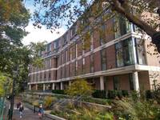
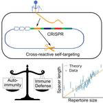

<link rel="stylesheet" href="gallery/css/blueimp-gallery.min.css">

#### Our lab's mission is to use computation and theory to understand immunology quantitatively.

We are a Quantitative Immunology research group in the [Division of Infection and Immunity](https://www.ucl.ac.uk/infection-immunity/) at UCL. 

Our approaches are often rooted in ideas from biological physics and we are part of UCL's [Institute for the Physics of Living Systems](https://www.ucl.ac.uk/physics-living-systems/).

Our research is embedded within the collaborative environment of the [Innate2Adaptive lab group](https://www.ucl.ac.uk/infection-immunity/research/research-department-infection/lab-research-groups/innate2adaptive) and we maintain strong links with multiple experimental and theory groups at UCL and beyond.

### News

- Apr 7 2022: The lab opens its doors at UCL!
- Mar 15 2022: Andreas gave a talk at the APS march meeting in an invited session on [Sensing chemical spaces](https://meetings.aps.org/Meeting/MAR22/Session/F14).
- Mar 5 2020: Andreas gave an invited (virtual) talk at the APS march meeting in the [Population dynamics in time-varying environments](http://meetings.aps.org/Meeting/MAR20/Session/U27) session.
- December 11-13 2019: We have organized a conference at PCTS on [Sensing chemical spaces](https://pcts.princeton.edu/events/2019/sensing-chemical-spaces). Video recordings of the lectures are available [here](http://www.kaltura.com/tiny/opthb).
{:.horn}

### Selected Publications

H Chen, A Mayer, V Balasubramanian **A scaling law in CRISPR repertoire sizes arises from avoidance of autoimmunity**, Current Biology, 2022. [<i class="ai ai-doi"></i>](https://doi.org/10.1016/j.cub.2022.05.021)

MG Gaimann, M Nguyen, J Desponds, A Mayer, **Early life imprints the hierarchy of T cell clone sizes**, eLife, 2020. [<i class="ai ai-doi"></i>](https://doi.org/10.7554/eLife.61639)

A Mayer, Y Zhang, AS Perelson, NS Wingreen, **Regulation of T cell expansion by antigen presentation dynamics**, PNAS, 2019. [<i class="ai ai-doi"></i>](https://doi.org/10.1073/pnas.1812800116)

A Mayer, O Rivoire, T Mora, and AM Walczak, **Diversity of immune strategies explained by adaptation to pathogen statistics**, PNAS, 2016. [<i class="ai ai-doi"></i>](http://dx.doi.org/10.1073/pnas.1600663113)

### Image Gallery

    
    
    

    

    <h3 class="title"></h3>
    <a class="prev">‹</a>
    <a class="next">›</a>
    <a class="close">×</a>
    
    <ol class="indicator"></ol>

