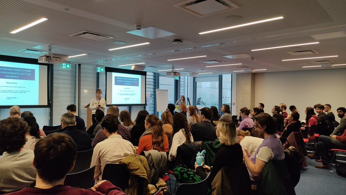
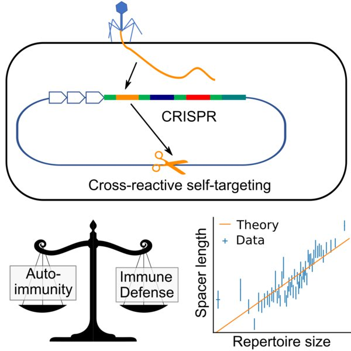
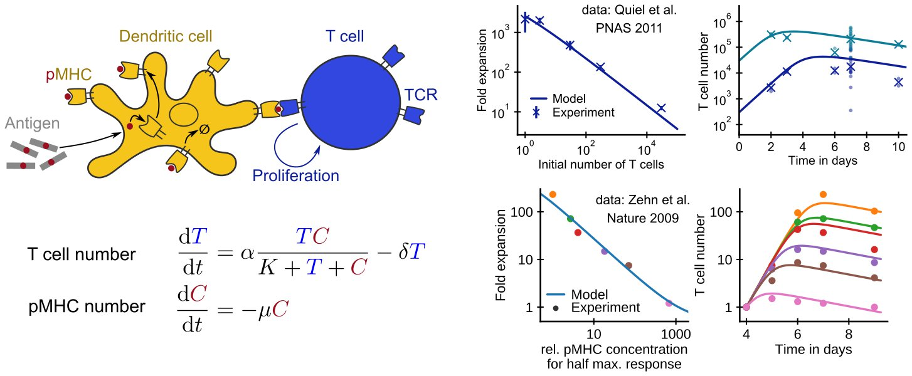

#### Our lab's mission is to understand immune defense quantitatively using theory and computation.

Our research integrates mathematical modelling and machine learning to quantitatively study adaptive immune responses across scales, from the molecular to the population level. By combining theoretical approaches with data-driven methods, we aim to uncover how immune repertoires evolve, respond to challenges, and contribute to disease pathology.

We are a research group in the [Division of Infection and Immunity](https://www.ucl.ac.uk/infection-immunity/) at UCL. Our approach to quantitative immunology is rooted in the tradition of biological physics and we are also part of the [Institute for the Physics of Living Systems](https://www.ucl.ac.uk/physics-living-systems/). Our research is embedded within the collaborative environment of the [Innate2Adaptive lab group](https://www.innate2adaptive.uk/) and we have strong links with experimental and theory groups at UCL and beyond.

You can find an overview of our research philosophy and research interests [here](https://qimmuno.com/research/) or you can take a look at some of our recent [publications](https://qimmuno.com/publications/). And finally, we have an open door policy for all of our lab meetings, so if you want to get a first-hand impression of what research questions we are most excited by at the moment email us and come stop by! 

### Selected News

- September 2025: Congratulations to Trupti Gore and James Henderson, who won the poster prize and Hackathon at the [Oxford Unravelling T cell recognition conference](https://web.cvent.com/event/7466b0c8-3ee9-4a4c-b781-d8b582130660/home)!
- July 2025: We organised a [UCL New Academics Day](https://lu.ma/gde2kquj) to connect new(ish) academics across faculties. Get in touch to join our network.
- June 2025: Andreas has been promoted to [Associate Professor](https://www.ucl.ac.uk/human-resources/hr-policies-procedures-and-advice/academic-careers-framework-and-promotions-processes/promotions) from October 1st.
- April 10th 2025: We organised the [3rd London Quantitative Immunology Day](https://qimmuno.com/ldnday/).
- October 2024: Congratulations to Dr. Yuta Nagano for his successful PhD defense and for being shortlisted for the IJEP Woolf Prize for best MBPhD thesis at UCL!
- July 2024: Our [Wellcome Discovery Team Award](https://wellcome.org/grant-funding/people-and-projects/grants-awarded/clonal-and-functional-t-cell-determinants) was funded enabling us to study the clonal and functional T cell determinants of protection and pathogenesis in tuberculosis for the next eight years.
- March 14th 2024: We organised the [2nd London Quantitative Immunology Day](https://qimmuno.com/ldnday2024/).
- January 2024: The London Quantitative Immunology Network now has a mailing list: Sign up instructions [here](https://qimmuno.com/ldnqimmuno/).
- December 2024: Our [Type 1 Diabetes Grand Challenge award](https://www.ucl.ac.uk/news/2023/dec/ucl-researchers-awarded-ps1m-investigate-new-treatment-type-1-diabetes) was funded enabling us to study mathematically how combination immunotherapies impact different immune cells involved in this autoimmune disease.
- December 2023: Silver and Bronze for the Q-Immuno lab in the [IMMREP23](https://www.kaggle.com/competitions/tcr-specificity-prediction-challenge/leaderboard) TCR Specificity Prediction Challenge!
- August 6 - 27, 2023: We co-organized a workshop on "Statistical physics and adaptive immunity" at the [Aspen Center for Physics](https://aspenphys.org/summer/past-workshops/summer-2023-workshops/). 
- March 9th 2023: We organized the [1st London Quantitative Immunology Day](https://qimmuno.com/ldnday2023/).
- July 25 2022: First paper from lab out on [bioRxiv](https://doi.org/10.1101/2022.07.25.501373)! Our first foray into deciphering TCR specificity quantitatively. 
- Apr 7 2022: The lab opens its doors at UCL!
- Mar 15 2022: Andreas gave an invited talk at the APS march meeting in the [Sensing chemical spaces](https://meetings.aps.org/Meeting/MAR22/Session/F14) session.
- Mar 5 2020: Andreas gave an invited (virtual) talk at the APS march meeting in the [Population dynamics in time-varying environments](http://meetings.aps.org/Meeting/MAR20/Session/U27) session.
- December 11-13 2019: We organized a conference at PCTS on [Sensing chemical spaces](https://pcts.princeton.edu/events/2019/sensing-chemical-spaces). Video recordings of the lectures are available [here](http://www.kaltura.com/tiny/opthb).
{:.horn}

### Selected Publications

A Mayer, C Callan **Measures of epitope binding degeneracy from T cell receptor repertoires**, PNAS, 2023. [<i class="ai ai-doi"></i>](https://doi.org/10.1073/pnas.2213264120)

H Chen, A Mayer, V Balasubramanian **A scaling law in CRISPR repertoire sizes arises from avoidance of autoimmunity**, Current Biology, 2022. [<i class="ai ai-doi"></i>](https://doi.org/10.1016/j.cub.2022.05.021)

MG Gaimann, M Nguyen, J Desponds, A Mayer, **Early life imprints the hierarchy of T cell clone sizes**, eLife, 2020. [<i class="ai ai-doi"></i>](https://doi.org/10.7554/eLife.61639)

A Mayer, Y Zhang, AS Perelson, NS Wingreen, **Regulation of T cell expansion by antigen presentation dynamics**, PNAS, 2019. [<i class="ai ai-doi"></i>](https://doi.org/10.1073/pnas.1812800116)

A Mayer, O Rivoire, T Mora, and AM Walczak, **Diversity of immune strategies explained by adaptation to pathogen statistics**, PNAS, 2016. [<i class="ai ai-doi"></i>](http://dx.doi.org/10.1073/pnas.1600663113)

### Image Gallery

  
  
The Institute of Immunity and Transplantation

  
  
London Q-Immuno Day 2023

  
  
What trade-offs shape prokaryotic immunity? (Current Biology 2022)

  
  
How is T cell expansion regulated? (PNAS 2019)

